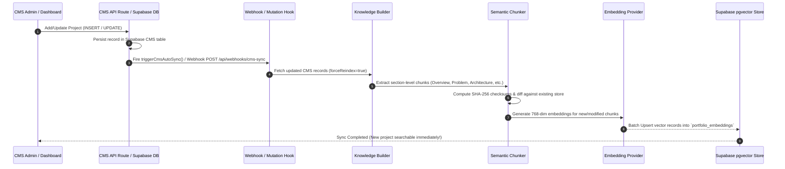

# CMS Automatic Synchronization Architecture (`docs/cms-sync.md`)

## Overview

The **CMS Auto Sync** system automatically synchronizes Supabase CMS updates (`INSERT`, `UPDATE`, `DELETE`) with the RAG Knowledge Index and `portfolio_embeddings` pgvector store.

Whenever any CMS entity (e.g., project, research paper, skill, certification, experience, or blog post) is added, updated, or deleted, the system **automatically**:
1. **Regenerates normalized knowledge documents** (`aggregateKnowledge`).
2. **Computes SHA-256 section checksums** and identifies modified/new chunks.
3. **Regenerates vector embeddings** (`generateEmbedding` via Gemini / OpenAI / Fallback).
4. **Updates the vector store** (`upsertVectorRecords` & `deleteObsoleteVectorRecords`).

**Zero manual rebuilds or scripts are required.** Adding a project in the CMS makes it searchable **immediately** in Ask Vedaang semantic retrieval.

---

## Synchronization Flow Diagram



---

## Trigger Mechanisms

### 1. API Route Mutation Hooks (`triggerCmsAutoSync()`)
All CMS API mutation routes (`POST`, `PUT`, `DELETE` in `/api/projects`, `/api/research/papers`, `/api/skills`, `/api/certifications`, `/api/experience`, etc.) trigger `triggerCmsAutoSync()` asynchronously in a non-blocking background promise.

- **Latency Impact**: 0ms added to API request response time.
- **Execution**: Background worker immediately updates knowledge index and pgvector embeddings.

### 2. Supabase Database Webhooks & Triggers (`/api/webhooks/cms-sync`)
For changes performed directly in the Supabase Dashboard or external database clients, database triggers (`supabase/migrations/20260803_cms_webhooks.sql`) call `net.http_post` or Supabase Webhooks targeting `POST /api/webhooks/cms-sync`.

### 3. Dedicated RAG Sync Endpoint (`POST /api/rag/sync`)
Exposes an explicit administrative endpoint to trigger full or incremental vector store sync:
```bash
# Trigger RAG sync via HTTP POST
curl -X POST http://localhost:3000/api/rag/sync?force=true
```

---

## Incremental Checksum & Chunking Strategy

To prevent redundant embedding generation and minimize LLM API cost:
- Each normalized document is split into section-level chunks.
- A SHA-256 checksum is calculated: `SHA256(docId:section:content:updatedAt)`.
- If the checksum matches the stored checksum in `portfolio_embeddings`, the existing vector is reused without calling the embedding API.
- If the document is deleted from CMS, obsolete vector records are purged automatically.

---

## Verification & Testing

To test automatic searchability:
1. Create or update a project via CMS API: `POST /api/projects`.
2. Observe auto-sync execution log: `[cms-sync] Auto-sync completed successfully`.
3. Query Ask Vedaang RAG search: `POST /api/ask` with query matching the new project.
4. Verify the new project appears in top retrieved documents immediately!
