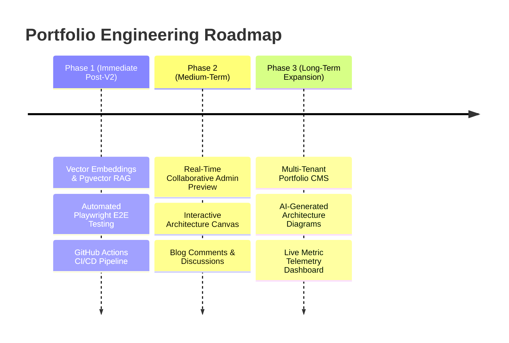

# Portfolio V2 Future Engineering Roadmap

This document presents the strategic technical roadmap for future enhancements, architectural iterations, and feature expansions beyond the V2 capstone release.

---

## 🗺️ Engineering Milestones & Phases

---

## 🔮 Detailed Feature Roadmap

### 1. 🧠 Vector Embeddings & Hybrid Pgvector RAG
- **Goal**: Transition AI Assistant retrieval from full-context RAG to chunked vector search.
- **Implementation**:
  - Integrate `pgvector` extension in Supabase PostgreSQL.
  - Generate embeddings using OpenAI `text-embedding-3-small` or Google Gemini embeddings.
  - Implement hybrid semantic search + keyword matching in `lib/ask/knowledgeAggregator.js`.

### 2. 🧪 Automated E2E Testing & CI/CD Pipeline
- **Goal**: Ensure zero regressions on every pull request.
- **Implementation**:
  - Add Playwright E2E test suite covering public pages, contact form submission, and AI drawer streaming.
  - Setup GitHub Actions workflow executing `npm run lint`, `npm run build`, and Playwright test suite.

### 3. 📊 Real-Time Telemetry & Visitor Analytics
- **Goal**: Surface high-level analytics in Admin Dashboard.
- **Implementation**:
  - Connect PostHog & Vercel Analytics APIs to `/admin/dashboard`.
  - Surface top viewed project case studies, popular AI queries, and contact conversion rates.

### 4. 💬 Reader Engagement & Blog Discussion System
- **Goal**: Enable community feedback on engineering articles.
- **Implementation**:
  - Integrate Giscus / GitHub Discussions API into `/blog/[slug]`.
  - Support markdown comments with moderation controls in CMS panel.

### 5. 🎨 Interactive System Architecture Visualizer
- **Goal**: Allow readers to interactively explore microservice flows.
- **Implementation**:
  - Integrate React Flow / Mermaid.js interactive diagrams inside `/projects/[slug]`.
  - Allow toggling node details for database queries, API gateways, and ML inference pipelines.
