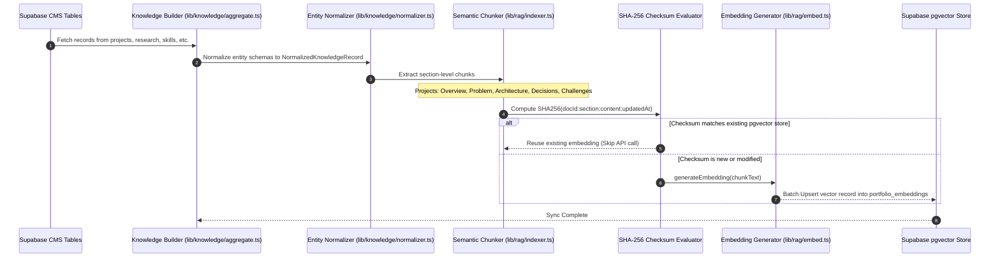

# Dynamic Knowledge Pipeline (`docs/knowledge-pipeline.md`)

## System Overview

The **Knowledge Pipeline** transforms raw, multi-table Supabase CMS content into normalized, section-level document chunks and 768-dimensional vector embeddings for the pgvector store.

---

## 1. Pipeline Flow Diagram

---

## 2. Entity Normalization (`lib/knowledge/normalizer.ts`)

Converts disparate Supabase CMS database tables into unified `NormalizedKnowledgeRecord` structures:

| CMS Table | Target Entity Type | Extracted Fields & Project Details |
| :--- | :--- | :--- |
| `projects` | `project` | Summary, Problem Statement, Architecture Notes, Tech Stack, Engineering Decisions, Challenges |
| `research_papers` | `research` | Title, Venue, Year, Abstract, DOI URL, Project Slug |
| `skills` | `skill` | Name, Category, Proficiency Level |
| `certifications` | `certification` | Title, Issuer, Year, Credential Link |
| `experience` | `experience` | Role, Company, Date Range, Bullet Points |
| `blog_posts` | `blog` | Title, Slug, Abstract, Content, Tags |

---

## 3. Section-Level Semantic Chunking (`lib/rag/indexer.ts`)

For complex entities such as engineering projects, single-document embedding dilutes retrieval precision. The chunker splits projects into targeted section chunks:

1. **Overview**: Summary and high-level goal.
2. **Problem Statement**: Target problem and motivation.
3. **Architecture & Stack**: System diagram description, microservices, and tech stack details.
4. **Engineering Decisions**: Trade-offs and design rationale.
5. **Challenges & Outcome**: Technical hurdles, CPU/memory optimizations, and deployment results.

For non-project entities (skills, research papers, certifications), single `Overview` chunks are generated.

---

## 4. Incremental SHA-256 Checksum Diffing

To optimize API costs and eliminate unnecessary embedding calls:
- Each chunk computes `SHA256(docId:section:content:updatedAt)`.
- Re-indexing compares the newly calculated checksum against the existing map fetched from Supabase.
- Only new or modified chunks trigger embedding API calls (`text-embedding-004` / `text-embedding-3-small` / fallback).
- Obsolete records whose `document_id` values no longer exist in the CMS are purged automatically.

---

## 5. Future Improvements

1. **Background Job Queue**: Migrate auto-sync execution from in-process micro-tasks to Upstash QStash or Redis background worker queues.
2. **Multi-Modal Embeddings**: Incorporate architecture diagrams and image representations into multimodal embedding indexes.
