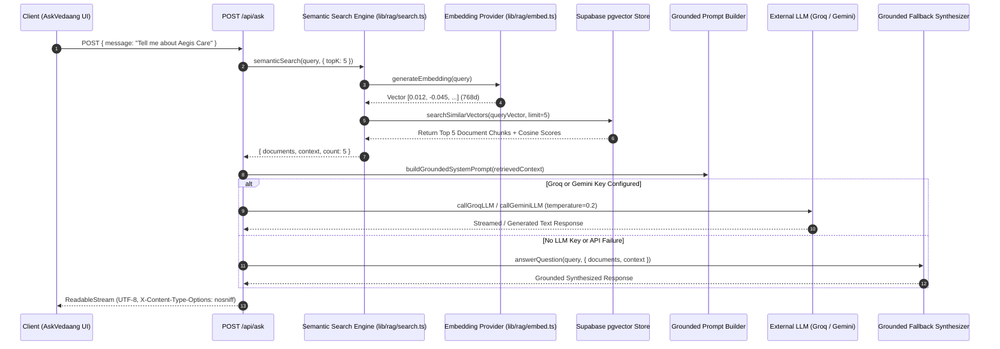

# Dynamic RAG System Architecture (`docs/rag-architecture.md`)

## System Overview

The **Ask Vedaang** AI assistant is built on a production-grade **Retrieval-Augmented Generation (RAG)** architecture using **Supabase pgvector**, **Cosine Similarity Search**, **Multi-Tier Embedding Providers**, and **WHATWG ReadableStream**.

Unlike primitive chat implementations that inject the entire portfolio database into the system prompt, this system performs **dynamic semantic retrieval**, passing ONLY the top 5 relevant document chunks to the LLM.

```
Question ──► Embedding (768d) ──► Cosine Similarity Search ──► Top 5 Chunks ──► Grounded Prompt ──► LLM ──► Streaming Response
```

---

## 1. End-to-End Execution Flow



---

## 2. Supabase pgvector Database Schema

The vector store table `portfolio_embeddings` and HNSW vector index are defined in `supabase/migrations/20260803_pgvector.sql`:

```sql
CREATE TABLE IF NOT EXISTS portfolio_embeddings (
  id UUID PRIMARY KEY DEFAULT gen_random_uuid(),
  document_id TEXT NOT NULL,
  type TEXT NOT NULL,
  title TEXT NOT NULL,
  section TEXT NOT NULL DEFAULT 'Overview',
  content TEXT NOT NULL,
  summary TEXT,
  tags TEXT[] DEFAULT '{}',
  url TEXT,
  embedding vector(768),
  metadata JSONB DEFAULT '{}'::jsonb,
  checksum TEXT NOT NULL,
  updated_at TIMESTAMPTZ DEFAULT NOW(),
  created_at TIMESTAMPTZ DEFAULT NOW(),
  CONSTRAINT unique_document_section UNIQUE (document_id, section)
);

-- HNSW Cosine Index for ultra-fast similarity search
CREATE INDEX IF NOT EXISTS idx_portfolio_embeddings_hnsw 
ON portfolio_embeddings 
USING hnsw (embedding vector_cosine_ops)
WITH (m = 16, ef_construction = 64);
```

### Cosine Similarity RPC Function
```sql
CREATE OR REPLACE FUNCTION match_portfolio_embeddings(
  query_embedding vector,
  match_threshold float DEFAULT 0.0,
  match_count int DEFAULT 5,
  filter_types text[] DEFAULT NULL
)
RETURNS TABLE (
  id UUID, document_id TEXT, type TEXT, title TEXT, section TEXT,
  content TEXT, summary TEXT, tags TEXT[], url TEXT, metadata JSONB, similarity FLOAT
)
LANGUAGE plpgsql
AS $$
BEGIN
  RETURN QUERY
  SELECT 
    pe.id, pe.document_id, pe.type, pe.title, pe.section, pe.content,
    pe.summary, pe.tags, pe.url, pe.metadata,
    1 - (pe.embedding <=> query_embedding) AS similarity
  FROM portfolio_embeddings pe
  WHERE 1 - (pe.embedding <=> query_embedding) >= match_threshold
    AND (filter_types IS NULL OR cardinality(filter_types) = 0 OR pe.type = ANY(filter_types))
  ORDER BY pe.embedding <=> query_embedding ASC
  LIMIT match_count;
END;
$$;
```

---

## 3. Semantic Retrieval Engine (`lib/rag/search.ts`)

- **Cosine Similarity Formula**: Evaluates dot product divided by magnitude product ($\frac{A \cdot B}{\|A\| \|B\|}$).
- **Category Filtering**: Supports filtering by `projects`, `research`, `experience`, `skills`, `blog`, `certifications`.
- **Top 5 Limit**: Defaults to returning the top 5 documents sorted descending by relevance score.
- **Pure Retrieval**: Executes vector search without calling any LLM text generation model.

---

## 4. Grounded Prompt Builder & Anti-Hallucination Guardrails

The system prompt builder incorporates **only** the top 5 retrieved documents:

```typescript
function buildGroundedSystemPrompt(retrievedContext: string): string {
  return `You are Ask Vedaang, an AI assistant representing Vedaang Sharma's engineering portfolio.

STRICT GROUNDING & CITATION RULES:
1. Answer the user's question accurately, concisely, and professionally using ONLY the RETRIEVED PORTFOLIO CONTEXT provided below.
2. Ground every answer. Do NOT hallucinate, invent, or assume any facts outside the provided retrieved context.
3. If the user's question cannot be answered using the provided context, state clearly and honestly: "I don't have that specific information in Vedaang's portfolio records. You can explore his work on the [Projects Page](/projects), read published papers on the [Research Page](/research), or send a message on the [Contact Page](/contact)."
4. CITATION REQUIREMENT:
   - For projects, include markdown links: e.g. [Project Title](/projects/slug).
   - For research papers, cite titles and venues: e.g. [Paper Title](/research).
   - For resume or CV, cite [Download Resume](/api/resume).
   - For contact information, cite email and [Contact Page](/contact).

RETRIEVED PORTFOLIO CONTEXT (Top 5 Relevant Documents):
${retrievedContext}`;
}
```

---

## 5. Future Improvements

1. **Hybrid Dense + Full-Text Search (RRF)**: Combine pgvector HNSW cosine search with Postgres `tsvector` GIN index using Reciprocal Rank Fusion (RRF).
2. **Multi-Turn Conversation Context Windowing**: Incorporate previous 3 dialog turns into query rewriting step.
3. **Cross-Encoder Re-Ranking**: Integrate Cohere Rerank API (`cohere-rerank-v3`) as a second-stage re-ranking layer before prompt assembly.
